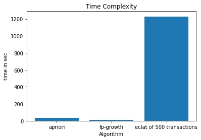
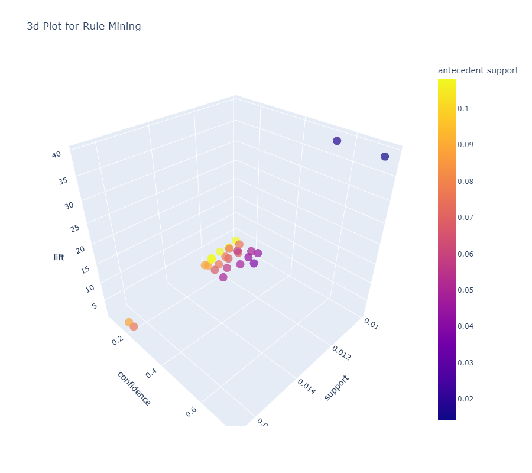
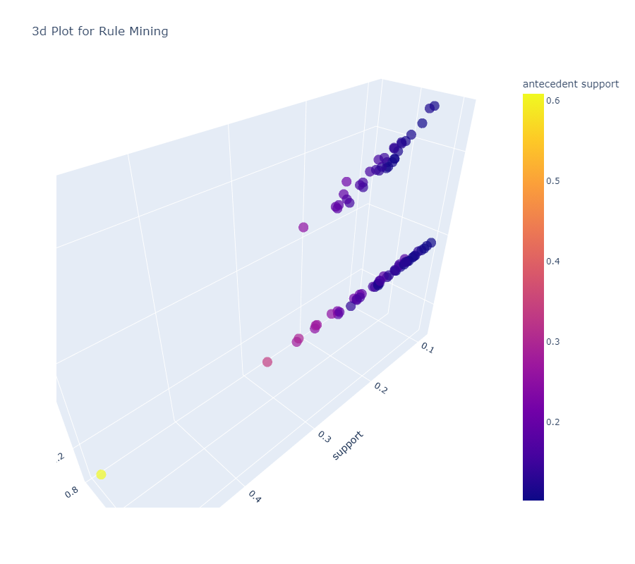
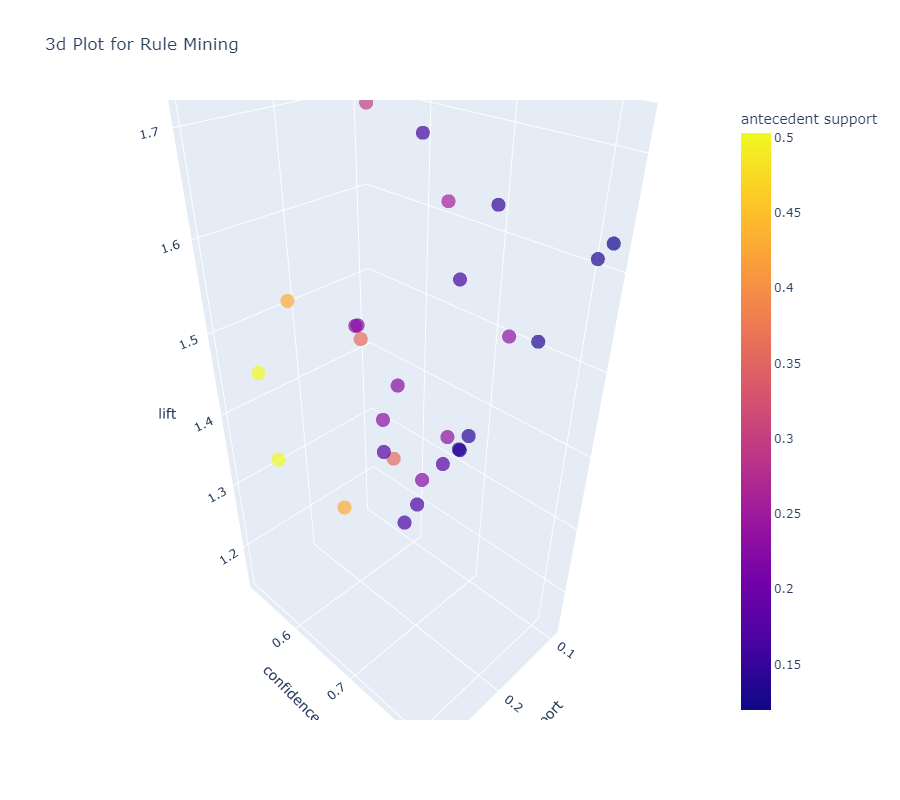

# Market Basket Analysis on Instacart Dataset 🛒

This project focuses on performing market basket analysis on the Instacart dataset to discover relationships between products, aisles, and departments. We utilized popular association rule mining algorithms, including FP-Growth, Apriori, and Eclat, to extract valuable insights from the dataset.

## About the Dataset 🥗

The Instacart dataset contains a collection of anonymized transaction data from an online grocery store. It includes information about customer orders, the products purchased, and the departments and aisles to which the products belong.

## Objectives 🎯

The main objectives of this project are as follows:

1. Discover Association Rules: Use association rule mining techniques to uncover interesting associations and relationships between products, aisles, and departments in the Instacart dataset.

2. Identify Purchase Patterns: Gain insights into the purchasing behavior of customers, such as which products are frequently purchased together or which products are commonly associated with specific aisles or departments.

3. Improve Marketing Strategies: Utilize the generated association rules to optimize product placement, cross-selling, and promotional strategies to enhance the shopping experience and increase sales.

## Algorithms Used 💭

We employed the following association rule mining algorithms:

1. **FP-Growth:** An efficient algorithm that constructs a compact data structure called an FP-tree to extract frequent itemsets and generate association rules.

2. **Apriori:** A classic algorithm that uses an iterative approach to generate frequent itemsets and association rules by pruning the search space based on the Apriori property.

3. **Eclat:** An algorithm that utilizes vertical data format and a depth-first search strategy to mine frequent itemsets and association rules.

## Implementation ✍️

To run the market basket analysis on the Instacart dataset, follow these steps:

1. Obtain the Instacart dataset, which can be downloaded from [source URL].
2. Preprocess the dataset by cleaning the data, removing duplicates, and transforming it into a suitable format for the selected algorithm.
3. Implement the chosen association rule mining algorithm (FP-Growth, Apriori, or Eclat) using your preferred programming language or data mining tool.
4. Run the algorithm on the preprocessed dataset to generate frequent itemsets and association rules.
5. Evaluate and analyze the results, focusing on the generated rules and their support, confidence, and lift values.
6. Interpret and validate the discovered associations to gain meaningful insights and actionable recommendations.

### Time Complexity

### Sample Apriori Product Associations

### Sample Apriori Department Associations

### Sample Apriori Aisles Associations

